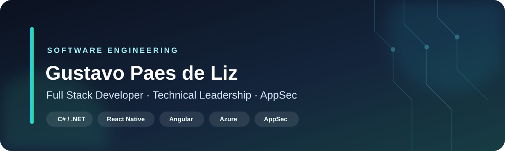

  

   

  [English](README.md) ·
  [LinkedIn](https://www.linkedin.com/in/gustavo-paes-de-liz) ·
  [Email](mailto:gustavo.paes.liz@gmail.com)

## Olá, eu sou o Gustavo

Desenvolvo e evoluo produtos backend, web e mobile com foco em entregas
confiáveis, arquitetura sustentável e segurança de aplicações.

Na **NDD Tech**, atuo com serviços C#/.NET, aplicações React Native, frontends
Angular e entrega em cloud. Também exerço direção técnica em um time mobile e
contribuo como **Security Champion**.

> Da arquitetura e implementação à entrega e qualidade em produção, gosto de
> transformar requisitos complexos em software que os times consigam evoluir
> com segurança.

## Projetos selecionados

### 🏍️ [MotoRental](https://github.com/GustaPaes/MotoRental)

API de locação de motos orientada a eventos com **.NET 8, PostgreSQL, RabbitMQ,
MongoDB, MinIO, Docker e testes automatizados**. O projeto demonstra
processamento assíncrono, separação de persistência, object storage e ambiente
local reproduzível.

### 🎭 [Playwright AI Starter](https://github.com/GustaPaes/playwright-ai-starter)

Template reutilizável de **Playwright e TypeScript** com orientação para
desenvolvimento assistido por IA, verificações rigorosas, evidências portáteis
de falha, GitHub Actions e Azure DevOps.

### 🧭 [AIOX Sprint Canvas](https://github.com/GustaPaes/aiox-sprint-canvas)

Workspace interativo em **React e TypeScript** que transforma um brief em
backlog priorizado, métricas de capacidade, quadro de execução, QA, riscos e
handoff portátil em Markdown/JSON.
[Acessar a aplicação](https://aiox-sprint-canvas.vercel.app).

### 🚀 [WebAppDeployer](https://github.com/GustaPaes/WebAppDeployer)

Utilitário de linha de comando em C# que automatiza pools, aplicações e
diretórios virtuais do IIS em entregas para Windows Server.

## Ferramentas e práticas

| Área | Tecnologias e práticas |
| --- | --- |
| **Backend** | `C#` `ASP.NET Core` `.NET` `APIs REST` `Microsserviços` `RabbitMQ` |
| **Web e mobile** | `React Native` `Angular` `AngularJS` `React` `TypeScript` |
| **Dados** | `SQL Server` `PostgreSQL` `MongoDB` `Redis` |
| **Cloud e entrega** | `Azure DevOps` `AKS` `Kubernetes` `Docker` `IIS` `CI/CD` |
| **Qualidade e segurança** | `Playwright` `Jest` `OWASP` `SAST` `DAST` `SonarQube` `Trivy` |

## Impacto na prática

| | Resultado |
| --- | --- |
| 👥 **Liderança técnica** | Direção, revisões e suporte para um time mobile de quatro desenvolvedores |
| 🛡️ **Segurança de aplicações** | Contribuição para reduzir vulnerabilidades reportadas em **35% em seis meses** |
| ⚡ **Performance de entrega** | Redução de **40%** no tempo de build em pipelines Azure DevOps |
| 📱 **Confiabilidade mobile** | Participação na atualização React Native 0.63 → 0.75, com aproximadamente **30% menos crashes** |

## Atualmente

- Desenvolvimento e manutenção de produtos backend, web, mobile, cloud e AppSec.
- Bacharelado em Sistemas de Informação em andamento na **UNIPLAC**.
- Interesse em desafios que conectem arquitetura, entrega e liderança técnica.

  <strong>Vamos conversar</strong>  
  <a href="https://www.linkedin.com/in/gustavo-paes-de-liz">LinkedIn</a>
  ·
  <a href="mailto:gustavo.paes.liz@gmail.com">Email</a>

